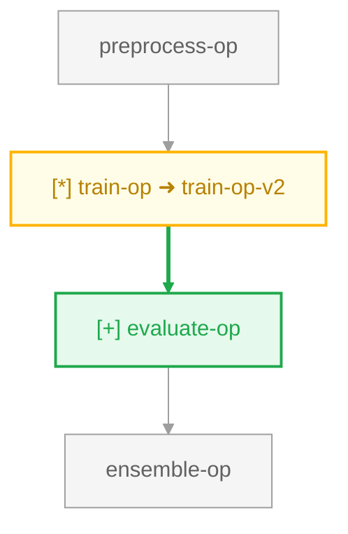

# KFP Pipeline Diff (kfp-pipeline-diff) 🧬

A lightweight, robust, and dependency-free automated command-line tool and GitHub composite action to parse, diff, and visualize changes in **Kubeflow Pipelines (KFP) v2** DAG structures, rendering a unified, color-coded Mermaid diagram inside sticky, auto-updating GitHub PR comments.

---

## 🌟 Features

- **Unified Color-Coded Diagram**: Combines the baseline ("before") and target ("after") state into a single visual DAG with clear status styling:
  - 🟢 **Added** (Green outline)
  - 🔴 **Removed** (Red dashed outline)
  - 🟡 **Modified / Renamed** (Amber outline)
  - ⚪ **Unchanged** (Gray outline)
- **Automatic DSL Compilation**: Compiles `.py` pipeline DSL files on the fly using the native KFP compiler, or parses pre-compiled `.yaml` or `.json` IR specifications.
- **Detailed Property Diffing**: Pinpoints exact changes in container images, command arguments, component references, and task inputs.
- **Pipeline-Level Parameter Tracking**: Automatically parses and diffs pipeline input signatures, default values, and parameter types.
- **Task Rename Heuristics**: Intelligently identifies task renames (`old-name` ➜ `new-name`) based on component structure similarity instead of reporting separate additions/removals.
- **Comment Size Safety**: Automatic truncation safeguards that protect against GitHub's 65KB limit by cleanly compacting large property change tables.
- **Directory Scan Mode**: Scans complete workspace directories, compiling and posting standalone reports with beautiful command-line summary reporting.
- **Zero-Dependency Action**: Runs entirely on Python's built-in modules (utilizing `urllib` for comments), meaning it loads in seconds with zero startup friction.
- **Sticky GitHub PR Comments**: Posts a markdown report to the PR, automatically updating on every push so reviewers always see the latest topology.

---

## 🛠️ Installation & Local Usage

To use the tool locally, clone the repository and install the package with standard development dependencies:

```bash
git clone https://github.com/mlopshero-official/kfp-pipeline-diff.git
cd kfp-pipeline-diff
pip install .
```

### CLI Command Options

#### Single Pair Mode
Compare a specific before and after pipeline:
```bash
kfp-pipeline-diff \
  --before pipeline_v1.yaml \
  --after pipeline_v2.py \
  --output report.md
```

#### Directory Scan Mode
Automatically scan a workspace folder for any changes against their Git baseline branches:
```bash
kfp-pipeline-diff \
  --pipelines-dir pipelines \
  --git-base-branch main
```

#### Complete CLI Arguments:
- `--before` / `-b`: Path to baseline compiled spec (.yaml, .json) or Python DSL script (.py).
- `--after` / `-a`: Path to target compiled spec (.yaml, .json) or Python DSL script (.py).
- `--pipelines-dir` / `-d`: Optional folder path to automatically locate and diff all pipelines.
- `--git-base-branch`: Baseline branch to compare scanned files against (defaults to `main`).
- `--output` / `-o` (Optional): Path to write the Markdown report locally.
- `--github-token` / `-t` (Optional): GitHub Token for writing comment outputs.
- `--github-repo` / `-r` (Optional): Repository formatted as `owner/repo`.
- `--github-pr` / `-p` (Optional): target Pull Request ID number.

---

## 🐙 Usage as a GitHub Action

Include KFP Pipeline Diff directly into your CI/CD workflows (e.g. `.github/workflows/kfp-diff.yml`) to generate topological diffs on every Pull Request update.

### Multi-Pipeline Directory Scan (Recommended)
This workflow scans the `pipelines/` directory on every PR and posts auto-updating sticky comments for *each* changed pipeline:

```yaml
name: KFP Pipeline Change Visualizer

on:
  pull_request:
    paths:
      - 'pipelines/**'

jobs:
  visualize-diff:
    runs-on: ubuntu-latest
    permissions:
      pull-requests: write # Required to post sticky comments
    steps:
      - name: Checkout Code
        uses: actions/checkout@v4

      - name: Set up Python
        uses: actions/setup-python@v5
        with:
          python-version: '3.11'

      - name: Render DAG Diff
        uses: mlopshero-official/kfp-pipeline-diff@main
        with:
          pipelines-dir: "pipelines"
          github-token: "${{ secrets.GITHUB_TOKEN }}"
```

### Single Pipeline Diff
If you only want to track changes to a single, specific pipeline file:

```yaml
      - name: Render DAG Diff
        uses: mlopshero-official/kfp-pipeline-diff@main
        with:
          before: "pipelines/baseline.yaml"
          after: "pipelines/target.py"
          github-token: "${{ secrets.GITHUB_TOKEN }}"
```

---

## 📊 Example Output Report

Below is an example of the structured, collapsible Markdown report generated by the tool and posted as a sticky comment inside Pull Requests:

```markdown
## 🧬 KFP DAG Structure Diff (PR #5)

### 📊 Summary Statistics

📦 **Pipeline**: `sample-training-pipeline`

| Change Type | Nodes (Tasks) | Edges (Dependencies) |
| :--- | :---: | :---: |
| 🟢 **Added** | 1 | 0 |
| 🔴 **Removed** | 0 | 0 |
| 🟡 **Modified / Renamed** | 1 | — |
| ⚪ **Unchanged** | 3 | 2 |

<details open>
<summary><b>🗺️ Unified DAG Diagram</b></summary>



_Legend: 🟢 green solid = added, 🔴 red dashed = removed, 🟡 amber solid = modified/renamed, ⚪ gray solid = unchanged_
</details>

<details open>
<summary><b>🎛️ Pipeline Input Parameters Diff</b></summary>

| Parameter | Status | Before (Baseline) | After (Target) |
| :--- | :--- | :--- | :--- |
| `epochs` | 🟡 Modified | `defaultValue: 10` | `defaultValue: 20` |
| `model_type` | 🟢 Added | — | `type: STRING`, `default: xgboost` |

</details>

<details>
<summary><b>🔍 Detailed Task Property Changes</b></summary>

<details>
<summary>⚙️ <b>train-op-v2</b></summary>

| Property | Before (Baseline) | After (Target) |
| :--- | :--- | :--- |
| `rename` | `train-op` | `train-op-v2` |
| `image` | `tensorflow/tensorflow:latest-gpu` | `tensorflow/tensorflow:2.15.0-gpu` |
| `args` | `--epochs`, `10` | `--epochs`, `20` |

</details>

</details>

---
_Report generated by **kfp-pipeline-diff**_
```

---

## 🧪 Testing

The codebase includes a fully covered test suite running on `pytest`. Run tests locally with:

```bash
PYTHONPATH=. pytest tests/
```

---

## 📄 License

This project is licensed under the MIT License.
